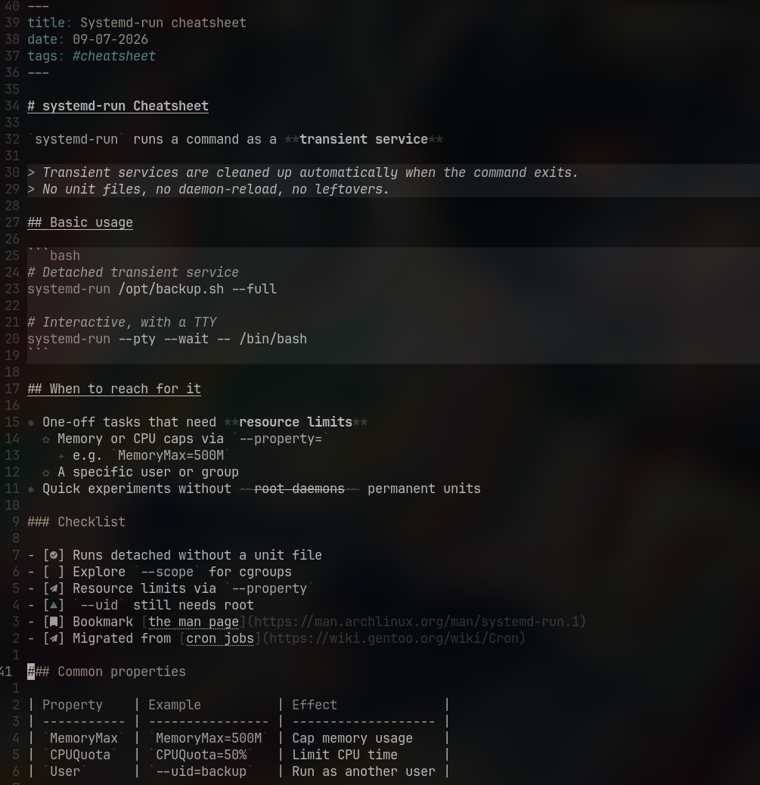

# touchup.nvim

Markdown improvements that don't move your text around.

Most markdown plugins make notes prettier by hiding things: URLs collapse, multiple heading symbols turn into single icons, `**` markers vanish until the cursor lands on them. touchup goes the other way. Icons, backgrounds and colors are drawn on top of the text you typed, so the buffer never reflows and nothing jumps when you move the cursor.



## What it does

- List bullets get icons that change with nesting depth (✸ ✿ ✦ ✧). _"We have org mode at home".jpg_
- Checkboxes show obsidian-style state icons inside the brackets: `[x]`, `[ ]`, `[!]`, `[>]` and more.
- Code blocks and block quotes get a subtle background. Quotes also render in cursive.
- `**`, `~~` and backtick markers are dimmed, not hidden. 
- H1 and H2 get underlines. The `#` markers stay where they are.
- Enter continues a list item (a checkbox item continues unchecked). Enter on an empty item exits the list.

## What it won't do

- Conceal URLs, syntax markers or anything else you typed.
- Format tables. Alignment is a formatter's job.
- Completions, diagnostics or wiki links. This is for a LSP server.
- Support anything other than Markdown

Needs the `markdown` and `markdown_inline` treesitter parsers.

## Install

```lua
{ "noisesfromspace/touchup.nvim", opts = {} }
```

## Config

Everything below is the default; pass only what you want to change.

```lua
require("touchup").setup({
  bullets = { enabled = true, icons = { "✸", "✿", "✦", "✧" } },
  checkboxes = { enabled = true },
  code_blocks = { enabled = true },
  markers = { enabled = true },
  quotes = { enabled = true },
  enter = { enabled = true },
})
```

All highlight groups are defined with `default = true`, so your colorscheme wins. Override any `Touchup*` group if you want different colors.

## The rest of the stack

touchup only decorates. This is the setup it is built to sit next to:

| Tool                                                                         | Does                                             |
| ---------------------------------------------------------------------------- | ------------------------------------------------ |
| [markdown-oxide](https://github.com/Feel-ix-343/markdown-oxide)              | LSP: completions, diagnostics, symbol navigation |
| [mdformat](https://github.com/hukkin/mdformat)                               | Formats markdown consistently                    |
| [mdformat-space-control](https://github.com/jdmonaco/mdformat-space-control) | Keeps lists tight, no random blank lines         |
| [conform.nvim](https://github.com/stevearc/conform.nvim)                     | Runs mdformat on save                            |
